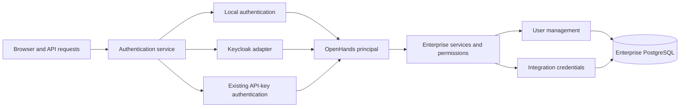

# Remove Keycloak as a hard dependency of OpenHands Enterprise

OpenHands will own its account identities, account lifecycle, sessions for local authentication, and authorization policy. Local email/password authentication will use FastAPI Users behind OpenHands-owned interfaces. The existing Keycloak integration will become a compatibility adapter. Fresh installations will default to local authentication; existing installations will retain Keycloak.

This is an implementation plan. The code references describe the repository reviewed at commit `4e8b65ebf`. Proposed services, tables, and endpoints below still need to be implemented. The [leadership plan](keycloak-removal-leadership-plan.md) provides the communication summary.

The scope is the Enterprise backend, frontend, storage, and Enterprise integration code in this repository. Helm charts and the separate automation and plugin directory services are excluded. Native OIDC, SAML, MFA, and customer migration between authentication modes are later milestones.

The following decisions define the implementation. Each new concern has one prescribed approach.

| Concern | Decision |
| --- | --- |
| Deployment selection | One startup flag, `KEYCLOAK_ENABLED`, with explicit upgrade compatibility. |
| Bootstrap inputs | `OH_BOOTSTRAP_ADMIN_EMAIL` and `OH_BOOTSTRAP_ADMIN_PASSWORD`, read directly from the environment. |
| Password implementation | FastAPI Users with `pwdlib` and Argon2id. |
| Application user model | Keep `storage.User` authoritative and preserve existing IDs. |
| Library integration | A custom database adapter projects OpenHands user and local credential records into the library's expected representation. |
| HTTP API | OpenHands owns the routes and request/response contracts. Thin local-auth routes call the FastAPI Users integration. |
| Local browser sessions | Opaque cookie tokens with SHA-256 digests stored in PostgreSQL. |
| Account enrollment | Administrator-created and invited accounts. Public registration is disabled. |
| Email delivery | Extend the existing SMTP email service. |
| Initial repository connection | Manually supplied provider access tokens through one connection API and credential store. |
| Authorization | Continue using the existing Enterprise instance and organization permissions. |

Compatibility with existing Keycloak deployments is a required transition behavior. It does not introduce additional configuration mechanisms for new local authentication.

The repository investigation identified these dependencies:

| Current implementation | Required change |
| --- | --- |
| [TokenManager](../server/auth/token_manager.py) combines authentication, identity lookup, account administration, and Git credential management. | Move authentication and identity administration into the Keycloak adapter. Extract provider credential operations into their own service. |
| [SaasUserAuth](../server/auth/saas_user_auth.py) understands Keycloak cookies and token refresh. Its API-key authentication is already independent of offline Keycloak sessions. | Retain the existing API-key behavior and adapt the common user context to the new authentication boundary. |
| [Authentication routes](../server/routes/auth.py) contain account creation, admission checks, verification, invitations, default organization membership, terms, onboarding, and login recording. | Extract shared application behavior and preserve its ordering. |
| [UserAuthorizer](../server/auth/user/user_authorizer.py) accepts `KeycloakUserInfo`. | Replace the provider response type with an OpenHands identity/profile type. |
| [UserStore](../storage/user_store.py) calls Keycloak while migrating legacy records during lookup. [SaasSettingsStore](../storage/saas_settings_store.py) has a related fallback. | Make ordinary storage reads local. Put legacy hydration behind an explicit compatibility service. |
| [UserStore.create_user](../storage/user_store.py) derives both the user and personal organization IDs from the caller's ID and grants the first user superadmin status. | Preserve identity relationships and make local bootstrap the only automatic superadmin creation path. |
| [UserStore.create_default_settings](../storage/user_store.py) invokes LiteLLM while creating account defaults. | Separate local account persistence from external service provisioning so bootstrap has a clear database transaction. |
| [Personal organization deletion](../storage/org_store.py) can delete the user row and rely on Keycloak to recreate it. | Preserve local accounts and credentials during workspace reset; handle account deletion separately. |
| [SaasSecretsStore](../storage/saas_secrets_store.py) discards `provider_tokens`. | Implement actual Enterprise persistence for manually supplied provider credentials. |
| [GitHub](../integrations/github/github_service.py), [GitLab](../integrations/gitlab/gitlab_service.py), and other integration services still use offline tokens and Keycloak identity lookup. | Route credential retrieval and provider identity resolution through the new credential service. |
| [Middleware](../server/middleware.py) checks Keycloak cookies for terms, verification, refresh, and logout. | Enforce application access rules against the common authenticated context. |
| [Frontend login URL generation](../frontend/src/utils/generate-auth-url.ts) and [provider linking](../frontend/src/utils/generate-idp-link-url.ts) construct Keycloak URLs. | Obtain authentication and connection capabilities from the backend; keep provider-specific URL construction server-side. |

The selected library is FastAPI Users. It provides extensible account management, authentication backends, password recovery and verification functionality, and password hashing through `pwdlib`. Its maintenance policy includes security updates and dependency maintenance. Feature development in OpenHands will occur around a contained integration. [Project documentation](https://github.com/fastapi-users/fastapi-users), [password hashing](https://fastapi-users.github.io/fastapi-users/latest/configuration/password-hash/)

The alternatives were evaluated as follows. They are not additional implementations to ship.

| Alternative | Assessment |
| --- | --- |
| Assemble authentication directly from `pwdlib`, SQLAlchemy, and Authlib | More account-flow logic would belong to OpenHands. FastAPI Users is selected to reuse its credential and user-manager behavior. |
| SuperTokens | Its self-hosted Core service introduces another authentication service to operate. That conflicts with the installation objective. [Architecture](https://supertokens.com/docs/deployment/self-host-supertokens) |
| django-allauth | Its headless API is capable, but adopting its Django application requirements would introduce a second account framework alongside FastAPI and SQLAlchemy. [Installation](https://docs.allauth.org/en/latest/headless/installation.html) |

The first implementation slice will validate the chosen library adapter against Enterprise's existing schema, Python dependencies, transaction requirements, and session strategy. Pin the selected dependency version in `pyproject.toml` and regenerate the lockfile with the repository's pinned uv version. This validates one implementation design; it does not create a runtime library selection mechanism.

The architecture has six application-facing contracts:

| Contract | Responsibility |
| --- | --- |
| `AuthenticationService` | Authenticate request credentials and return an OpenHands `Principal`. Coordinate the shared login admission flow before issuing application access. |
| `BrowserSessionBackend` | Issue, validate, and revoke browser sessions. Local and Keycloak implementations keep their session details private. |
| `PasswordCredentialService` | Verify, establish, change, and reset local passwords using the FastAPI Users integration. |
| `UserManagementService` | Create, retrieve, search, update, disable, and delete accounts; coordinate credentials, membership, and cleanup. |
| `IdentityRepository` | Map external issuer/subject identities to stable OpenHands user IDs. |
| `ProviderCredentialService` | Store, retrieve, refresh, and disconnect integration credentials, and resolve provider account identities to OpenHands users. |

Use these interfaces at the actual boundaries. Internal helpers remain ordinary implementation details. Select the two supported authentication implementations at startup without introducing a general plugin-loading system.



`Principal` contains the OpenHands user ID, authentication method, session or API-key identifier, authentication time, and existing API-key organization binding. Passwords, upstream tokens, and library-specific user objects stay inside their implementations. Existing permissions remain authoritative for instance and organization access.

Preserve `get_user_auth`, `SaasUserAuth`, and `UserContext` as compatibility entry points while delegating their work to the new services. Background operations receive an explicit authorized user context and effective organization. They must not fabricate a browser session or require an offline refresh token.

Translate implementation exceptions into application errors: `InvalidCredentials`, `SessionExpired`, `AuthenticationUnavailable`, and `ProviderReconnectRequired`. An invalid Git credential produces a reconnection error while the OpenHands session remains valid. A temporary identity-provider outage produces an availability error and does not silently switch authentication modes.

FastAPI Users is contained in the local authentication package. Its custom database adapter reads the same user and credential rows used by OpenHands. The adapter derives `is_active` from the account's disabled state and derives any library-required superuser representation from the existing instance-role policy. There is no independently writable second privilege flag. Password hashes are visible only to the credential implementation.

OpenHands routes call the common account services and the local credential implementation. Preserve existing public account routes and add password-specific endpoints with explicit schemas. Do not mount generic user CRUD routes that create a second path around Enterprise lifecycle rules. The library's `UserManager` supplies reusable credential behavior; its database adapter and hooks connect that behavior to the application. [UserManager](https://fastapi-users.github.io/fastapi-users/latest/configuration/user-manager/), [database adapter](https://raw.githubusercontent.com/fastapi-users/fastapi-users/master/fastapi_users/db/base.py)

The deployment flag has precise startup semantics:

| Installation state | `KEYCLOAK_ENABLED` | Selected behavior |
| --- | --- | --- |
| Fresh installation without legacy Keycloak configuration | Unset | Initialize local authentication. |
| Existing installation with recorded authentication mode | Unset | Retain the recorded mode. |
| Existing installation without recorded mode | Unset | Detect legacy identity data or explicitly supplied Keycloak configuration and record Keycloak mode. |
| Fresh installation requiring Keycloak | `true` or `1` | Initialize Keycloak mode and validate its required configuration. |
| Fresh installation using local authentication | `false` or `0` | Initialize local authentication and bootstrap the administrator. |
| Populated installation requesting a different mode | Explicit value differing from recorded mode | Reject an unprepared switch. A flag change does not migrate identities or credentials. |

Parse the flag case-insensitively, accept the boolean spellings required by repository compatibility, and reject invalid values. It is a deployment setting, not a per-user or organization feature flag.

Add one installation-auth record and initialize it under a database lock. For legacy detection, inspect existing `user`, `user_settings`, `auth_tokens`, and `offline_tokens` data and explicitly configured Keycloak server/realm/client settings. Do not infer Keycloak from a computed hostname default. An installation with configured Keycloak and zero users still retains Keycloak. Ambiguous legacy state produces a configuration error.

After initialization, the recorded mode is stable even if accounts are deleted or legacy environment variables disappear. It records established deployment state and is not a second user-editable configuration surface. Mode changes require a coordinated deployment and an explicit migration procedure; workers must agree on the selected mode.

Local mode must initialize without any Keycloak settings. It does not initialize Keycloak clients, register active Keycloak callbacks, or invoke Keycloak through storage or integration fallbacks. Keep existing callback paths, cookies, provider broker flows, and required Keycloak behavior inside the compatibility adapter for Keycloak installations. An unavailable Keycloak server never causes fallback to local password authentication.

The storage changes are additive:

| Record | Contents and invariants |
| --- | --- |
| Existing `user` | Canonical ID, profile, disabled state, and current Enterprise instance role. |
| `local_credentials` | User ID, unique normalized login email, Argon2id password hash, and password-change requirement. |
| `external_identities` | User ID, configured connection, issuer, and subject; uniqueness on the external identity tuple. |
| `auth_sessions` | Token digest, user ID, creation and expiry timestamps, and restricted-access state for initial password changes. |
| `auth_action_tokens` | Token digest, purpose, user ID, intended email when applicable, expiry, and consumption state. |
| Installation-auth record | Selected mode, bootstrap administrator ID, and bootstrap completion state. |
| Existing `auth_tokens` | Extend credential metadata for manual tokens, nullable refresh/expiry fields where inapplicable, provider account ID, and provider host. |

Preserve every existing OpenHands user ID and relationship. New local users receive server-generated UUIDs; their personal organization continues using the same ID. Existing columns named `keycloak_user_id` keep their physical names during this release and continue storing the OpenHands user ID. New service contracts use neutral names.

Keep uniqueness for local login emails in `local_credentials`. The current user store allows duplicate emails, so a global unique constraint on `user.email` could break upgrades. Normalize local login email consistently by trimming surrounding whitespace and using case-insensitive matching. Preserve plus addressing and dots. The existing base-email anti-abuse policy is not an identity-normalization rule.

External identity lookup uses issuer and subject, never an automatic email match. Changing a local login email updates its credential record and application profile in one transaction, with explicit verification of the replacement address. Retain legacy Keycloak email behavior inside its adapter during compatibility work.

Refactor account creation so user, credential, required organization, membership, and bootstrap state can participate in one transaction. Required relationships must not depend on an after-registration callback. External provisioning, including LiteLLM, occurs outside that transaction and must be idempotent and retryable.

Bootstrap has exactly two inputs:

```text
OH_BOOTSTRAP_ADMIN_EMAIL
OH_BOOTSTRAP_ADMIN_PASSWORD
```

Read both directly from the environment. Normalize the email using the local login policy. Validate the password without trimming or transforming it. Bootstrap runs after schema initialization and before accepting authentication traffic on an uninitialized local installation.

Under the installation lock, create the designated user, its local credential, required organization membership, and existing instance superadmin role. Record bootstrap completion in the same transaction. Concurrent replicas must produce exactly one designated administrator.

Missing or invalid bootstrap inputs prevent an uninitialized local installation from becoming ready and produce a specific setup error. Once bootstrap is complete, these variables have no effect. Restarts, changed environment values, account demotion, and account deletion never reset a password or re-grant privileges. Keycloak-mode upgrades do not execute local bootstrap.

The initial password grants only the access needed to set a new password and log out. Password change clears that restriction and replaces the restricted session. Disable the first-user-superadmin shortcut for all ordinary local account creation. Keep the existing final-superadmin protection across demotion, disabling, and deletion.

Account enrollment is administrator-created or invitation-based. Do not add public registration. Administrator-created users receive an initial password that must be changed. Invited users set their password using a purpose-bound invitation enrollment flow. Both use the same account-management service and permission checks.

Initial bootstrap and administrator-created accounts work without SMTP. An administrator's assertion of an email address permits the explicitly provisioned account to sign in; it does not establish ownership of that mailbox. Keep email verification separate and require proof of ownership before automatically accepting email-addressed invitations or linking identities.

Use the existing SMTP service for invitation delivery, email verification, and self-service password reset. Derive availability from its existing configuration rather than adding another enable flag. Provide one explicit operator recovery command for recovering access to an existing administrator when email recovery is unavailable. Recovery revokes sessions and updates an existing credential; it does not reuse bootstrap or create a new superadmin.

For local sessions, generate a cryptographically random token and store only its SHA-256 digest in PostgreSQL. Use a host-only `Secure`, `HttpOnly`, `SameSite=Lax` browser cookie with path `/`. Local sessions have a fixed 24-hour absolute lifetime. Issue a new token at login and after password change. Local authentication has no refresh-token flow.

Implement one session strategy against this store. FastAPI Users' stock database strategy passes bearer tokens to storage, so the digest-only requirement needs the custom adapter/strategy. Its JWT strategy does not revoke tokens on logout. [Database strategy](https://raw.githubusercontent.com/fastapi-users/fastapi-users/master/fastapi_users/authentication/strategy/db/strategy.py), [JWT logout behavior](https://fastapi-users.github.io/fastapi-users/latest/configuration/authentication/strategies/jwt/)

Normal logout deletes the current browser session. Password reset revokes all browser sessions. Account disabling rejects all authentication for that user, including API keys, and revokes existing sessions and keys. Ordinary browser logout preserves API keys. All authenticated entry points check the current account state.

Reset tokens expire after one hour and verification tokens after 24 hours. Store token digests, bind each token to its purpose and user, and consume it atomically with the corresponding state change. Apply CSRF protection and origin validation to cookie-authenticated state changes, including login. Validate return destinations on the server and never put credentials in redirect parameters.

Throttle login and recovery by account identifier and source IP across replicas using the existing rate-limit infrastructure. Password endpoints fail with a temporary-unavailable response when the shared limiter cannot enforce limits. Use generic authentication/recovery responses and a dummy password-hash check for unknown accounts. Keep passwords, session tokens, recovery tokens, and upstream credentials out of logs.

User disabling and deletion must establish local denial and revocation before remote cleanup. A Keycloak outage must not leave locally valid credentials active. Keep failed remote cleanup explicit and retryable. Preserve the final-superadmin invariant atomically under concurrent operations.

For local accounts, resetting a personal workspace preserves the user and password credential, clears workspace-owned data, and re-establishes a valid personal workspace/membership in one transaction. Explicit account deletion owns credential removal. Preserve the legacy Keycloak re-onboarding behavior while that adapter is supported.

The shared login flow must preserve current admission and onboarding policy: validate the identity and account state, apply email requirements, establish the account, process invitations, apply default organization membership, and enforce terms and onboarding. Explicit invitation roles take precedence over default organization membership. Record successful login and dispatch noncritical analytics after the required account state is established.

Repository access is part of the first local-auth release. Implement one API for connecting manually supplied provider access tokens and persist them through `ProviderCredentialService` in the existing encrypted credential storage. The current SaaS secrets implementation discards these tokens, so merely exposing the existing token-entry UI is insufficient.

Validate each connection using the provider API and store the provider's stable account ID and host with the OpenHands user association. Preserve existing credential and organization authorization boundaries. Resolve webhook actors through these explicit mappings rather than through Keycloak attributes or guessed email matches. Linking requires an authenticated user and proof of control of the provider account.

Update Enterprise Git provider services, token refresh consumers, disconnect routes, and background context helpers to use this service. Reuse direct provider-refresh implementations for existing OAuth credentials. Expired or revoked provider credentials produce `ProviderReconnectRequired` without ending the OpenHands login. Temporary provider outages retain stored credentials and produce a retryable availability error.

Existing Keycloak installations retain their current broker-based connection acquisition through the compatibility adapter. Direct OAuth connection setup is a later milestone implemented with Authlib against the same credential service. Login providers and repository connections remain separate concepts.

The frontend consumes a backend-owned authentication-capabilities response describing password login, available login providers, enrollment policy, and email-recovery availability. Repository connection capabilities are separate. A local installation always shows the password form, and remembered Keycloak login choices cannot redirect it into a disabled integration.

Add the initial-password-change, password-change, reset, verification, and account-enrollment screens. Update the account-management screens to use the shared lifecycle API. Preserve invitation destinations, terms, onboarding, and device-login return paths. Keep API access in data-access clients wrapped by TanStack Query hooks.

Move Keycloak authorization URL construction to its backend adapter while preserving existing callback contracts. Future OAuth/OIDC authorization requests will use server-bound state, PKCE, issuer/nonce checks, and server-validated redirects. Local authentication stays within the application origin.

Implementation should proceed in this order:

| Stage | Deliverable | Completion gate |
| --- | --- | --- |
| 1. Establish boundaries | OpenHands principal and account interfaces, the chosen FastAPI Users adapter integration, extracted provider credential service, and Keycloak compatibility adapter. | Existing Keycloak tests pass through the new boundaries; library and transaction integration are verified. |
| 2. Preserve installation mode | Startup flag, installation-auth state, legacy detection, and additive identity/credential migrations. | Fresh and legacy state selection is deterministic; mismatched mode changes fail explicitly. |
| 3. Deliver local accounts | Transactional bootstrap, passwords, sessions, account provisioning, recovery, disabling, and workspace-reset behavior. | Concurrent bootstrap and account-lifecycle tests pass without Keycloak. |
| 4. Complete application flows | Capability-driven frontend, invitations, terms/onboarding, and repository token connections. | Local accounts can complete the install-to-conversation path and integration credential flows. |
| 5. Validate compatibility | Regression, migration, SDK, integration, and end-to-end tests for both supported modes. | Existing Keycloak installations retain their supported behavior and data relationships. |
| 6. Release the fresh-install default | Local authentication enabled by default for new installations, with finalized operator documentation. | Both release gates below pass; the new default ships only with the complete local-account path. |

The first release gate is a fresh installation with no Keycloak configuration and no reachable Keycloak server. Bootstrap, initial password change, user provisioning, repository connection, conversation creation, account disabling, and recovery must work. Verify bootstrap and administrator-created accounts with SMTP absent, and verify email flows with SMTP configured.

The second release gate is an upgrade of an existing Keycloak installation. Preserve user IDs, personal organization identities, organization memberships, instance permissions, existing cookies, supported SAML/OIDC and broker login behavior, API keys, repository credentials, and legacy user hydration.

The validation matrix covers the following behavior:

| Area | Required checks |
| --- | --- |
| Bootstrap | Concurrent replicas, missing inputs, invalid inputs, restart, changed environment values, completed bootstrap after demotion, and transaction failure. |
| Account lifecycle | Final-superadmin protection, session and API-key revocation, single-use recovery tokens, workspace reset preserving local credentials, and explicit account deletion. |
| Identity | Duplicate legacy emails, local email uniqueness, stable IDs, collision rejection, and no automatic external identity linking by email. |
| Session behavior | Expiry, logout, initial-password restriction, password changes, CSRF, rate limiting, and temporary storage/provider failures. |
| API and SDK | Existing API-key headers, precedence and organization binding, device login, user settings, and sandbox credential inheritance. Preserve bearer identity plus owned-sandbox checks for exposing secrets. |
| Integrations | Credential persistence and refresh, disconnect, provider actor lookup, background access without offline sessions, and provider failures independent of application login. |
| Architectural isolation | Local-mode tests fail on Keycloak client construction or requests. Import checks keep `fastapi_users` inside the local integration and `keycloak` inside its adapter. |
| Migrations and release | Fresh schema, legacy schema/data upgrades, PostgreSQL constraints and locks, and application rollback on the additive schema while retaining Keycloak mode. |

Use SQLite-backed unit tests for application logic. Use PostgreSQL for migration, uniqueness, locking, and concurrency validation. Add frontend flow tests and end-to-end tests in both authentication modes. Run the repository's required backend pre-commit checks and frontend lint/build checks before pushing implementation changes.

Customer migration is separate from making Keycloak optional. Preserve external identity mappings and credentials during the compatibility period. The later migration procedure must inventory accounts, resolve missing or ambiguous emails, enroll local credentials or native SSO identities as required by the destination mode, preserve all IDs and permissions, validate administrator access, and then deliberately change the recorded authentication mode. It must not assume Keycloak passwords are recoverable or promise that toggling the flag imports them.

The native-authentication roadmap uses one library per mechanism:

| Mechanism | Library and implementation direction |
| --- | --- |
| OIDC and OAuth | Authlib, already present in [pyproject.toml](../pyproject.toml). Implement direct connections through the existing authentication and credential boundaries. [Documentation](https://docs.authlib.org/en/latest/oauth2/client/web/starlette.html) |
| SAML | `python3-saml`, with strict validation and explicit metadata/certificate management. Its XML dependencies make this a separate milestone. [Project documentation](https://github.com/SAML-Toolkits/python3-saml) |
| TOTP | `pyotp`, with OpenHands-owned enrollment, replay prevention, recovery, and enforcement policy. [Documentation](https://pyotp.readthedocs.io/en/stable/) |
| Passkeys | `webauthn`, with OpenHands-owned credential enrollment and recovery. [Documentation](https://duo-labs.github.io/py_webauthn/) |

Implement native OIDC before SAML. Schedule native MFA separately from the initial password release. Continue directing customers who need SAML/OIDC or their existing Keycloak-enforced authentication policies to the Keycloak integration until the corresponding native capabilities and migration path are complete.
