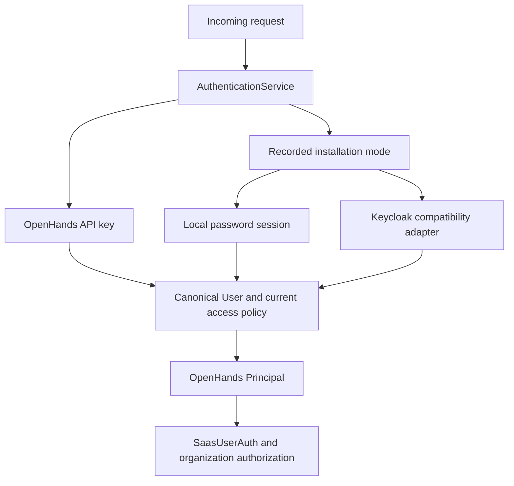

# Authentication and account management

Enterprise supports local passwords and the existing Keycloak integration. A fresh installation without legacy identity data or explicit Keycloak configuration uses local authentication. Startup records the selected mode in PostgreSQL before accepting authentication traffic. An existing recorded mode takes precedence over detection, and a conflicting `KEYCLOAK_ENABLED` setting fails startup. Changing the flag does not migrate accounts.

See [Operating authentication](../operations/authentication.md) for setup and recovery instructions.

## Application boundaries

The interfaces in [`server/auth/contracts.py`](../../server/auth/contracts.py) keep account identity, browser authentication, and repository credentials separate.

| Boundary | Responsibility |
| --- | --- |
| `AuthenticationService` | Resolves request credentials to an OpenHands `Principal` and checks the current account state. |
| `BrowserSessionBackend` | Issues, validates, and revokes browser sessions. |
| `PasswordCredentialService` | Establishes, verifies, changes, and resets local passwords. |
| `UserManagementService` | Owns canonical account lookup, search, creation, email-change requests, and lifecycle operations under Enterprise permissions. |
| `IdentityRepository` | Resolves and records explicit external identity associations by connection, issuer, and subject. |
| `ProviderCredentialService` | Validates and stores repository connections, refreshes credentials, and resolves provider actors. |

`Principal.user_id` identifies the existing `user` row. Its authentication method distinguishes password sessions, Keycloak sessions, API keys, and background work. It contains internal session or key identifiers, not bearer credentials. `SaasUserAuth` adapts this principal to the application server's user and organization context.

Instance permissions continue to come from `User.role_id`; organization permissions come from `OrgMember.role_id`. Local authentication does not introduce an independently writable administrator flag.

## Browser and API authentication

Local passwords use Argon2id. Browser sessions contain random opaque tokens; PostgreSQL stores their SHA-256 digests and fixed 24-hour expiry. The host-only cookie uses `Secure`, `HttpOnly`, `SameSite=Lax`, and path `/`. Cookie-authenticated mutations use origin validation and CSRF protection. Password and recovery endpoints enforce shared Redis limits and return a temporary availability error if those limits cannot be enforced.

Bootstrap and administrator-created accounts initially receive a restricted session. They must replace their initial password before entering the application. Password changes issue a replacement session. Password reset revokes existing browser sessions, and ordinary logout revokes the current browser session while preserving API keys.

Keycloak clients, broker behavior, SDK types, and remote account operations live in [`server/auth/keycloak/`](../../server/auth/keycloak/). Keycloak installations retain their existing callback paths, cookies, SAML/OIDC providers, and broker connection flows. Local mode does not construct Keycloak clients or fall back to Keycloak for missing accounts. A Keycloak outage never switches the installation to password authentication. Newly provisioned Keycloak accounts attempt offline-token acquisition for compatibility. If that optional step fails, provisioning still returns the new initial password and API key; a later browser sign-in can acquire the offline credential. Re-provisioning preserves the existing password and does not repeat a password grant.

API keys remain usable in both installation modes. Their organization binding and existing header precedence are preserved. Authentication checks the canonical disabled state. Secret-bearing SDK user settings additionally require a bearer API key and proof of an owned, running sandbox.

## Account storage and admission

The existing `user` table is the canonical directory. New local accounts receive a UUID and a personal organization with the same UUID. The user, normalized login email, password credential, personal organization, and owner membership commit together. Bootstrap designates its administrator and records completion in that transaction. Remote LLM provisioning happens afterward and can be retried without changing the account password or identity.

Local login emails are unique in `local_credentials`. Existing `user.email` values retain their compatibility behavior, including duplicate legacy addresses. Columns historically named `keycloak_user_id` keep their physical names and continue storing the OpenHands user ID.

Ordinary `UserStore` reads use the local database. Authenticated Keycloak entrypoints explicitly call `EnterpriseUserManagementService.ensure_authenticated_account` for legacy `user_settings` hydration and missing-email backfill. This compatibility path preserves the existing user and personal organization IDs.

Shared admission processes an explicit invitation before pending email invitations and default organization membership. An administrator-supplied local email is not mailbox verification. Automatic acceptance requires a verified address. Possession of a matching invitation secret establishes ownership and accepts membership atomically. Invitation enrollment creates the local account and invited membership in one transaction. Terms and onboarding policy then apply to the established account.

Email changes issue a purpose-bound verification token. Consuming it updates the canonical email and local login credential in one transaction. Reset and verification tokens are single-use digests with fixed expiries.

## Lifecycle and repository connections

Disabling an account commits local denial and revokes browser sessions, API keys, offline tokens, and pending account-action tokens before remote cleanup. Deletion retains a disabled account while external cleanup is pending; repeating the operation reconciles that cleanup. Enable, disable, and delete serialize per account across the remote step. Demotion, disabling, and deletion share a database lock that protects the final active instance administrator.

Resetting a local personal workspace preserves the account UUID, password, profile, instance role, and browser sessions. Workspace data and membership are reset together while retaining a valid personal organization. Explicit account deletion owns credential removal. The Keycloak compatibility path retains legacy re-onboarding behavior and stable IDs.

Repository tokens are encrypted separately from browser credentials. Manual connections validate the supplied token against the provider and store its stable account ID and host. Background work resolves an enabled OpenHands user and organization without requiring an offline Keycloak browser session. A revoked repository credential requests reconnection while the OpenHands login remains valid. External identities are never linked automatically by matching email addresses.
